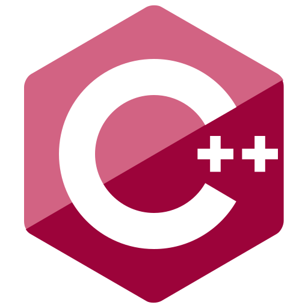

<h1 align="center">Hello World </h1>
<h4 align="center">I'm Sandaruwan. Friends call me <i>S4NDM4N</i></h4>

*  :keyboard: Things I type: [**C#**:heart:](https://dotnet.microsoft.com/en-us/languages/csharp) | [ASP.NET](https://dotnet.microsoft.com/en-us/apps/aspnet) | [Bash:purple_heart:](https://en.wikipedia.org/wiki/Bash_(Unix_shell)) | [PHP](https://www.php.net/) | [JavaScript](https://www.javascript.com/) | [SQL](https://en.wikipedia.org/wiki/SQL).
*  :mechanic: I'm currently working on [DEA.NEXT](https://github.com/s4ndm4n82/DEA.Next) | [AwesomeWM CE](https://github.com/s4ndm4n82/eos-awesome-ce).
*  *  :handshake: Love to collaborate on [EneavourOS](https://github.com/EndeavourOS-Community-Editions/awesome).
*  :briefcase: Owner of [SwiftScripter](https://github.com/SwiftScripters).
*  :office: Currently I'm working for [Pro Account Lanka](https://pro-account.lk/).
*  :book: Planing to learn  |  |  | .
*  :speech_balloon: Please ask me about anything [C family](https://www.bairesdev.com/blog/c-family-programming-languages-differences/).

  
  

<!--
**s4ndm4n82/s4ndm4n82** is a ✨ _special_ ✨ repository because its `README.md` (this file) appears on your GitHub profile.

Here are some ideas to get you started:

- 🔭 I’m currently working on ...
- 🌱 I’m currently learning ...
- 👯 I’m looking to collaborate on ...
- 🤔 I’m looking for help with ...
- 💬 Ask me about ...
- 📫 How to reach me: ...
- 😄 Pronouns: ...
- ⚡ Fun fact: ...
-->
